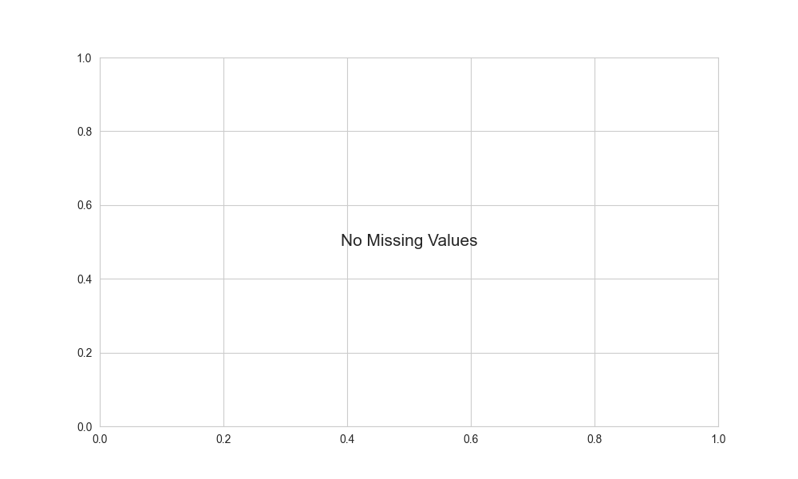
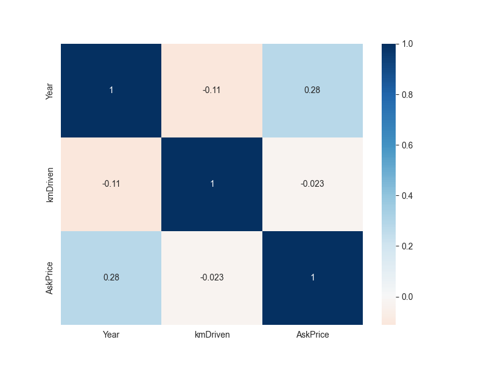
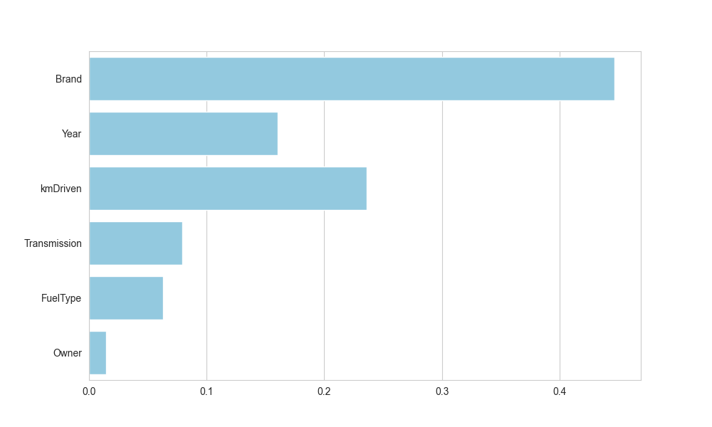

# AI 기반 중고차 적정 가격 예측 서비스 (Prototype)

본 프로젝트는 데이터 분석부터 모델 학습, 웹 서비스 배포까지의 머신러닝 파이프라인 전 과정을 구축한 사례입니다.

---

## 1. 프로젝트 개요
* **목적**: 중고차 시장 데이터를 분석하여 차량 정보 입력 시 예상 적정 가격을 실시간으로 제시하는 서비스 구현
* **핵심 기술**: Python, Scikit-learn, RandomForest, Streamlit
* **서비스 링크**: [실시간 가격 예측 서비스 바로가기](여기에_배포된_Streamlit_URL_삽입)

---

## 2. 데이터 분석 및 전처리

### 데이터 무결성 검토
결측치 분석 결과, 주요 피처에서 결측치가 발견되지 않아 데이터 전체를 학습에 활용하여 정보 손실을 최소화했습니다.


### 시각화 분석 및 인사이트
* **다중공선성 검토**: 연식(Year)과 주행거리(kmDriven) 간의 상관관계를 확인하였으나, 트리 기반 모델의 강건함(Robustness)을 활용하여 모든 변수를 학습에 포함했습니다.
* **변수 중요도**: 분석 결과 '브랜드(Brand)'가 가격 결정의 가장 핵심 요인임을 파악하였습니다.

| 상관관계 분석 | 변수 중요도 (RandomForest) |
| :---: | :---: |
|  |  |

---

## 3. 모델 성능 비교 및 선정

다양한 알고리즘을 테스트한 결과, 현재 데이터셋에서 가장 안정적이고 높은 성능을 보인 RandomForest를 최종 모델로 선정했습니다.

| 모델명 | 결정계수 (R²) | 오차 (RMSE) | 비고 |
| :--- | :---: | :---: | :--- |
| 선형 회귀 (Linear Regression) | 0.19 | 1,279,572 | 낮은 설명력 (베이스라인) |
| XGBoost | 0.53 | 977,516 | 데이터 규모 대비 과적합 경향 |
| **RandomForest** | **0.66** | **825,019** | **최종 채택 (최고 성능)** |

---

## 4. 주요 기능 및 서비스 특징
* **실시간 가격 예측**: 사용자 입력 데이터(브랜드, 연식, 주행거리 등)를 기반으로 ML 모델이 즉각적인 시장 가치 산출
* **직관적인 UI**: Streamlit을 활용하여 데이터 과학 지식이 없는 사용자도 쉽게 사용 가능한 인터페이스 구축
* **분석 기반 인사이트**: 모델의 변수 중요도를 시각화하여 어떤 요소가 가격에 큰 영향을 주는지 사용자에게 정보 제공

---

## 5. 실행 방법 (Local)

```bash
# 환경 설정
pip install -r requirements.txt

# 서비스 실행
streamlit run app.py